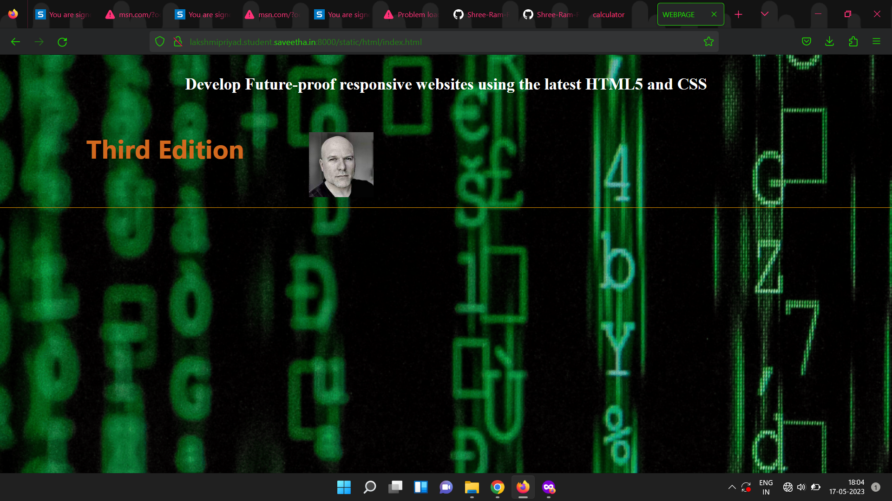

# cover-page-design

## AIM:

To develop a website to display the cover page design of a book

## Design Steps:

### Step 1:

Create a new Django project and app.

### Step 2:

Create a static file directory and mention the changes in settings.

### Step 3:

Make a new folder templates inside your app and create a html and map them using views and url.

### Step 4:

Write down the code for book cover using HTML and CSS.

### Step 5:

Add images and other contents using CSS record a screenshot of it.

# Code:

## HTML:

```
<!DOCTYPE html>
<html lang="en">
  <head>
    <meta charset="UTF-8" />
    <meta http-equiv="X-UA-Compatible" content="IE=edge" />
    <meta name="viewport"/>
    <title>WEBPAGE</title>
    <link rel="stylesheet" href="index.css" />
    <link
      rel="stylesheet"
      href="https://stackpath.bootstrapcdn.com/bootstrap/4.5.2/css/bootstrap.min.css"
    />
  </head>
  <body>
    <div class="bg-container">
      <div class="heading1">
        <h1 class="code">Coding</h1>
        <hr align="left" />
      </div>
      <div class="main">
        <div class="content">
          <h1 id="head">Responsive Web Design With HTML5 And CSS</h1>
          <p id="con">
            Develop Future-proof responsive websites using the latest HTML5 and
            CSS
          </p>
        </div>
      </div>
      <div class="footer">
        <div class="container d-flex flex-row">
          <div class="mar">
            <h1 id="bot-head">Third Edition</h1>
          </div>
          <div class="img-mar">
            
          </div>
        </div>
        <hr class="bot" />
      </div>
    </div>
  </body>
</html>

```

## CSS:

```

.bg-container{
    background-image: url(' https://d1tgh8fmlzexmh.cloudfront.net/ccbp-static-website/codingbg.png ');
    background-size: cover;
    height: 150vh;


}
.code{
    color: blue;
    padding-left: 20px;
    padding-top: 20px;
    font-family:  'Times New Roman';
    font-weight: bold;

}
hr{

    background-color: orange;

    width: 200px;


}
.main{
    padding: 40px;
    text-align: center;
    color: white;
    font-family: 'roboto';
}
#head{
    font-size: 70px;
    font-weight: bold;
    padding-bottom: 10px;
}
#con{
    font-size: 25px;
    font-weight: bold;
}
.bot{
    background-color: orange;
    width: 100%;

}
#bot-head{
    color: chocolate;
    font-weight: bold;
}
.img{
    width: 50%;

}
.mar{
    text-align: left;
}
.img-mar{
   text-align: right;

}

```

# Output:



# Result:

Thus the program to develop a website to display the cover page design of a book is done.

